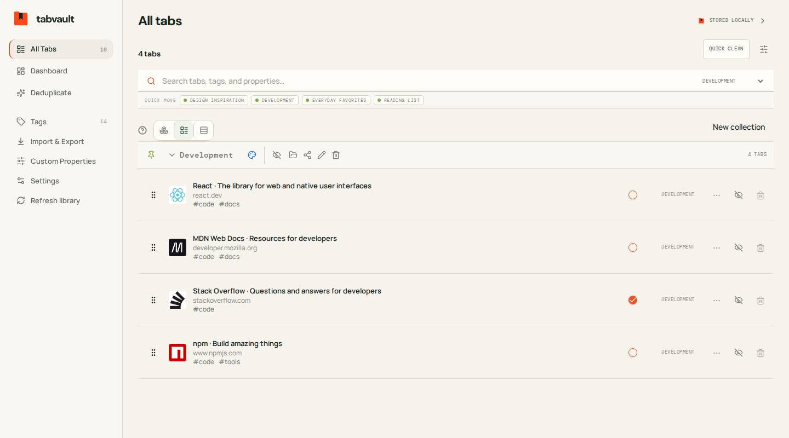
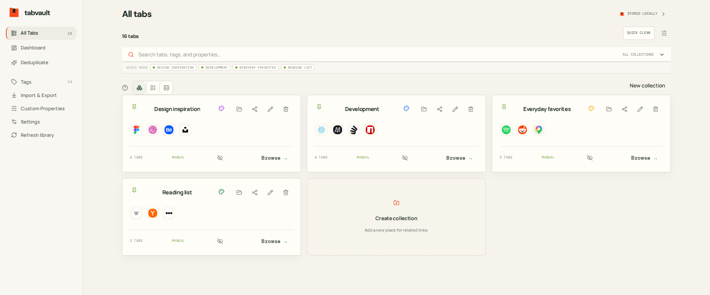
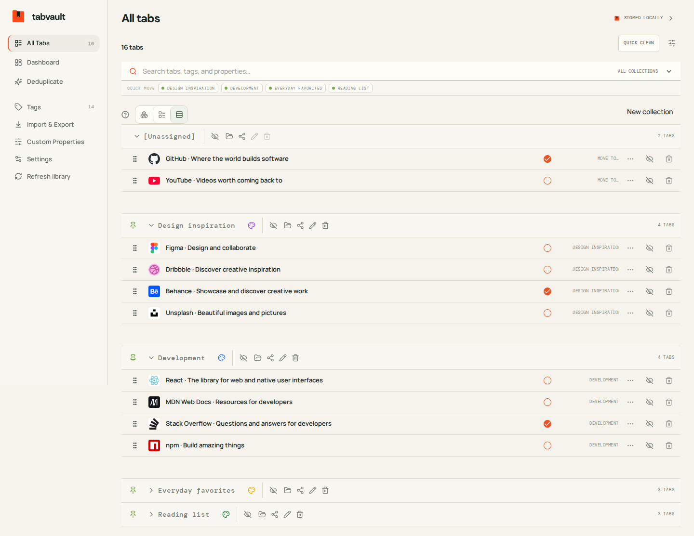

# TabVault

A React/Vite tab library with browser-local storage, a Chrome extension, a FastAPI server, and an MCP bridge. Tabs are saved occurrences: repeated URLs retain separate IDs and the original URL.

## Screenshots

A sample browser-local library with popular websites, organized into Development, Design inspiration, Reading list, and Everyday favorites.

**Standard view** — saved tabs with website domains, tags, and reading status. Shown here with the Development collection selected.



**Collection board** — related websites grouped into collections with favicon previews and actions to open or browse each collection.



**Compact view** — a denser list of saved tabs, with collections that can be collapsed.



## Run

```bash
pnpm install
pnpm dev
```

Build with `pnpm build`. Load `dist/public/` as an unpacked Chrome extension for tab capture, or serve that directory as a static website. The website can organize saved records; browser capture requires the extension.

```bash
cd server
uv sync --group dev
TABVAULT_HTTP__API_KEY=admin TABVAULT_HTTP__HOST=0.0.0.0 uv run tabvault-server
```

By default, the server stores its SQLite database at `~/.local/share/tabvault/tabvault.sqlite3`, under the home directory of the user running the server. Set `TABVAULT_STORAGE__DATA_DIR` to change the data directory.

The command above sets the server API key to `admin`, matching the extension's default for trusted local use. Leave the server running, then connect the extension:

1. Click the extension toolbar icon, choose **Open TabVault workspace**, and open **Settings**.
2. Under **Storage mode**, select **Backend preferred**. New installations use **Local only** until you enable the backend.
3. Keep **API endpoint** at `http://127.0.0.1:47821` (without `/api/v1`) and **API key** at `admin`.
4. Click **Save & check**. A successful connection shows **Server connected** and a green indicator, and synchronizes the library. Use **Check now** to test the connection again.

API key validation is enabled only when the server has a nonempty `TABVAULT_HTTP__API_KEY`, supplied through the environment or `server/.env`. With no server key configured, a local server accepts any key, so **Check now** can succeed even if you change the extension's key. The extension's default `admin` does not configure authentication on the server.

To use a different key, stop the running server and restart it from `server/` with `TABVAULT_HTTP__API_KEY=your-key uv run tabvault-server`, then enter the same key in extension Settings and click **Save & check**. A missing or incorrect key now returns **401 Unauthorized**.

For network access, set `TABVAULT_HTTP__HOST=0.0.0.0`, a strong `TABVAULT_HTTP__API_KEY`, and restrictive `TABVAULT_HTTP__CORS_ORIGINS`, and use the server's network address and matching key in Settings. The default host `127.0.0.1` accepts only loopback connections. See [running the API on another machine](server/README.md#network-access) for the launch command and `/docs` access. All `/api/v1` requests use `X-API-Key`.

`TABVAULT_SERVER_URL` sets the MCP client's destination; it does not change the backend's listening address. Configure the backend with `TABVAULT_HTTP__HOST` and `TABVAULT_HTTP__PORT`.

```bash
cd mcp
TABVAULT_SERVER_URL=http://127.0.0.1:47821 TABVAULT_HTTP__API_KEY=admin uv run tabvault-mcp
```

## Debug playground

Start the backend with debugging enabled:

```bash
cd server
TABVAULT_DEBUG__ENABLED=true TABVAULT_HTTP__API_KEY=admin TABVAULT_HTTP__HOST=0.0.0.0 uv run tabvault-server
```

Open [the debug playground](http://127.0.0.1:47821/debug). This styled Swagger page applies the configured API key automatically. Expand **tabs** or **groups**, select POST to create a record or GET to list records, edit the request values, and click **Execute**. Responses appear below the request. Requests affect the current database; closing the page does not undo changes.

**Unsafe:** anyone who can access this page can obtain the server API key and change live data. The server logs a warning at startup, and the page displays the warning with instructions to disable it. When finished testing, set `TABVAULT_DEBUG__ENABLED=false` (or remove it when no `.env` setting enables it) and restart the backend. Debug mode is off by default.

These options can be set in `server/.env` or the environment; restart the server after changes:

| Setting                                   | Default | Purpose                                                                |
| ----------------------------------------- | ------- | ---------------------------------------------------------------------- |
| `TABVAULT_DEBUG__ENABLED`                 | `false` | Master switch for debug tools.                                         |
| `TABVAULT_DEBUG__PLAYGROUND_ENABLED`      | `true`  | Allow `/debug` while debug mode is enabled; otherwise return HTTP 404. |
| `TABVAULT_DEBUG__DATABASE_BACKUP_ENABLED` | `true`  | Allow manual database copies while debug mode is enabled.              |

## Database backup

Backup routes appear in their own **backups** group in the debug playground and API documentation.

With debug mode enabled, create a copy of the server's current SQLite database:

```bash
curl -X POST -H 'X-API-Key: admin' http://127.0.0.1:47821/api/v1/backups/database
```

The response is HTTP 201 with `{"success":true,"data":{"path":"/absolute/path/to/backups/backup-<timestamp>-<id>.sqlite3"}}`. By default, copies are stored under `~/.local/share/tabvault/backups/`. The copy includes committed data still in SQLite's write-ahead log and does not change the live library. Use your configured API key in place of `admin`.

Manual database backups require both `TABVAULT_DEBUG__ENABLED=true` and `TABVAULT_DEBUG__DATABASE_BACKUP_ENABLED=true`. Disabling either option rejects the endpoint with HTTP 403. The backup switch moved from `TABVAULT_STORAGE__DATABASE_BACKUP_ENABLED` to the debug setting; update existing configuration. Existing automatic JSON backups before clearing or replacing the library remain enabled.

The `scheduled` reason in the JSON backup list means a startup snapshot: on server startup, a JSON backup is created if none with this reason exists or the latest one is more than 24 hours old. There is no recurring timer while the server runs. These JSON snapshots are separate from manual `.sqlite3` copies and remain enabled when debug mode is off.

The server keeps the latest **30 backups in total**, combining JSON snapshots and manual SQLite copies. After a successful backup and at startup, it deletes older backup files and their JSON metadata. Cleanup only targets registered JSON snapshots and SQLite copies matching the generated `backup-<timestamp>-<id>.sqlite3` filename format directly inside `backups/`. Other files, subdirectories, symlinks, and the live database are left untouched. Failed backups do not trigger cleanup.

## Library behavior

- Standard, Compact, and collection-board views share tab lifecycle and placement commands. Quick Move sits below search and targets manual collections.
- Search matches titles, original URLs, tags, and resolved custom properties. Quick Clean archives exact duplicates; advanced deduplication previews type-based merge policies.
- Edit tab contains a schema-driven custom-property editor. Missing overrides use defaults; resetting removes the override. Undeclared raw values remain stored.
- Note, Agent Review, and Viewed are custom properties. Clients declare conventions on demand without changing an incompatible existing definition. The server assigns no special meaning to these names.
- Local only keeps changes in browser storage. Backend preferred persists changes locally first, then synchronizes tabs, groups, tags, definitions, values, and positions in one transaction. Preferences and saved views stay local.
- Active tabs are archived before permanent removal. Deleting a collection archives and unassigns its members. Hidden records remain inaccessible through MCP.
- The extension commits a complete capture before closing source tabs. It uses `tabs`, `storage`, `sidePanel`, and `alarms`; the alarm retries pending sync work.

Schema v5 is a clean break. Existing browser bytes remain available for recovery download. Old databases are rejected before mutation; use a separate fresh data directory after preserving the old one. There is no automatic upgrade or reset. Server clear, replace, and restore change the library generation; stale clients must export their local copy and explicitly adopt the new server library in Settings.

See [Feature guide](docs/FEATURE_GUIDE.md), [storage and synchronization](docs/STORAGE_AND_ARCHIVE_LIFECYCLE.md), and [grouped contracts](docs/GROUPED_CONTRACTS.md).

## Checks

```bash
pnpm validate
pnpm test:unit
pnpm test:extension
pnpm test:e2e
make -C server check
make -C mcp check
```
