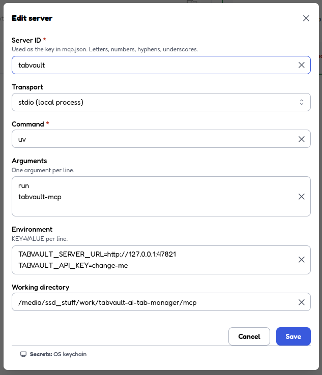

# TabVault MCP Bridge

The standalone Python MCP service proxies agent tools to TabVault's authenticated REST API through
one asynchronous typed client. It never opens SQLite directly, so API validation, visibility, and
transaction rules remain the source of truth.

## Install and run

```bash
cd mcp
uv sync
TABVAULT_SERVER_URL=http://127.0.0.1:47821 \
TABVAULT_API_KEY=change-me \
uv run tabvault-mcp
```

The URL defaults to `http://127.0.0.1:47821`; the API key has no default. Start the local TabVault
API first, then attach an MCP host with the same two variables.

## MCP Inspector (development)

Use [MCP Inspector](https://github.com/modelcontextprotocol/inspector) to exercise tools, resources,
and prompts without an IDE host:

```bash
cd mcp
npx @modelcontextprotocol/inspector
```

Add a stdio server with the settings in [misc/inspector.png](misc/inspector.png):



| Field             | Value                                                                         |
| ----------------- | ----------------------------------------------------------------------------- |
| Server ID         | `tabvault`                                                                    |
| Transport         | `stdio (local process)`                                                       |
| Command           | `uv`                                                                          |
| Arguments         | `run` then `tabvault-mcp` (one argument per line)                             |
| Environment       | `TABVAULT_SERVER_URL=http://127.0.0.1:47821` and `TABVAULT_API_KEY=change-me` |
| Working directory | absolute path to this `mcp/` package                                          |

## Cursor

Add a project server in `.cursor/mcp.json`, or a global server in `~/.cursor/mcp.json`. Cursor
Settings → MCP → Add new MCP server uses the same fields as the Inspector screenshot.

```json
{
  "mcpServers": {
    "tabvault": {
      "command": "uv",
      "args": [
        "--directory",
        "/absolute/path/to/tabvault/mcp",
        "run",
        "tabvault-mcp"
      ],
      "env": {
        "TABVAULT_SERVER_URL": "http://127.0.0.1:47821",
        "TABVAULT_API_KEY": "change-me"
      }
    }
  }
}
```

Replace the `--directory` path with this repo's `mcp/` folder. After saving, toggle the server on
under Cursor Settings → MCP (or restart Cursor) and confirm `tabvault` shows its tools.

## Codex

Register a stdio server in `~/.codex/config.toml`, or in a trusted project's `.codex/config.toml`:

```toml
[mcp_servers.tabvault]
command = "uv"
args = ["run", "tabvault-mcp"]
cwd = "/absolute/path/to/tabvault/mcp"

[mcp_servers.tabvault.env]
TABVAULT_SERVER_URL = "http://127.0.0.1:47821"
TABVAULT_API_KEY = "change-me"
```

Or add the same launch from the CLI:

```bash
codex mcp add tabvault \
  --env TABVAULT_SERVER_URL=http://127.0.0.1:47821 \
  --env TABVAULT_API_KEY=change-me \
  -- uv --directory /absolute/path/to/tabvault/mcp run tabvault-mcp
```

In a Codex session, run `/mcp` to confirm the server connected.

## Tools

The service exposes 15 annotated tools with no persisted IDs in their public contracts:

- Tabs: `list_tabs`, `search_tabs`, `get_tab`, `save_tab`, `update_tab`, `delete_tab`, and
  `move_tab`.
- Groups: `list_groups`, `get_group`, `create_group`, `update_group`, and `delete_group`.
- Tags: `list_tags`, `tag_tab`, and `untag_tab`.

Tab tools select the oldest visible exact-URL match. Group tools match names without case and select
the oldest match. IDs remain private to the REST bridge; MCP cannot read or mutate hidden or archived
content.

## Resources and prompts

Compact read-only context is available at `tabvault://groups`, `tabvault://tags`,
`tabvault://recent{?limit}`, `tabvault://unassigned{?limit}`, and
`tabvault://tabs{?url}`. The server also exposes the user-selected prompts
`organize_unassigned`, `research_digest`, and `weekly_tab_review`.

These names follow TabVault's domain model: Unassigned is not an Inbox, Saved URLs remain unchanged,
and repeated URLs are separate save occurrences. Prompts propose a plan before any mutation and use
single-record tools after approval.

## Development

```bash
cd mcp
uv sync
make check
```

The check runs Ruff formatting and linting, strict Pyright, and pytest with a 90% coverage floor.
